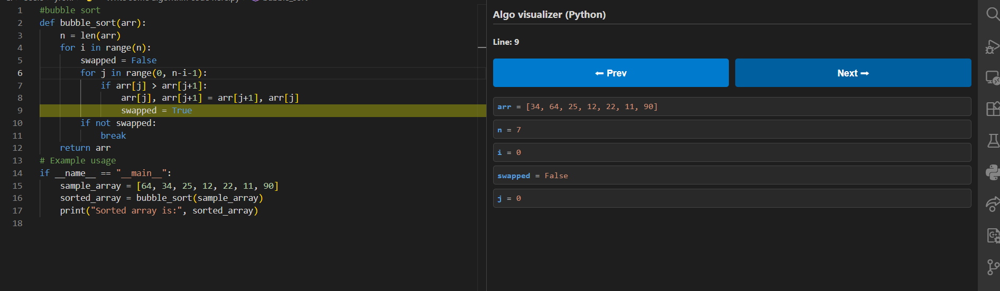

# Algo visualizer (Python)
A lightweight code visualizer for Python.

## Features
- **Multi-Language:** Supports Python, C, C++, and Java.
- **Line-by-Line:** Step through your code execution.
- **Visuals:** See variables (lists, vectors) update in real-time.

---
**Made by Rohit Yadav | B.Tech NIT Jalandhar**
---

---

